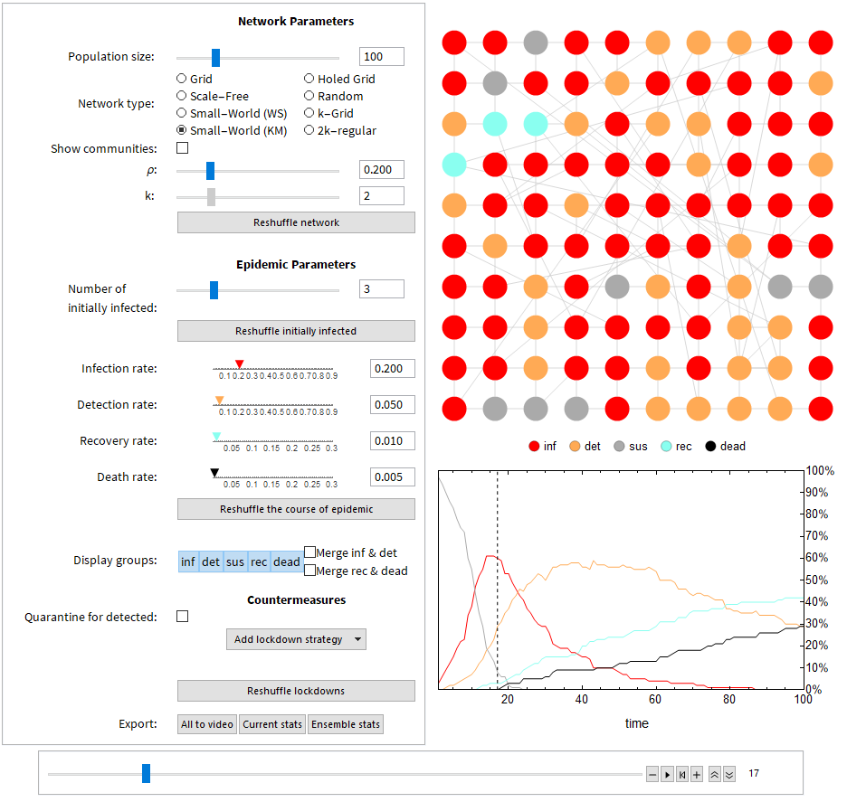

# pandemic_simulator
Simple pandemic simulator written in Mathematica. It allows to see evolution of pandemics as well as to export several relevant statistics. It operates on a few different network types including random ones, and allows to vary parameters characteristic to the SIDR model that can be influenced by a few lockdown strategies.

